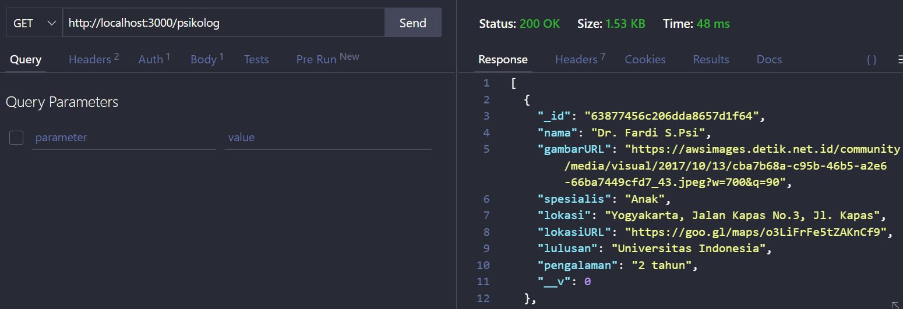
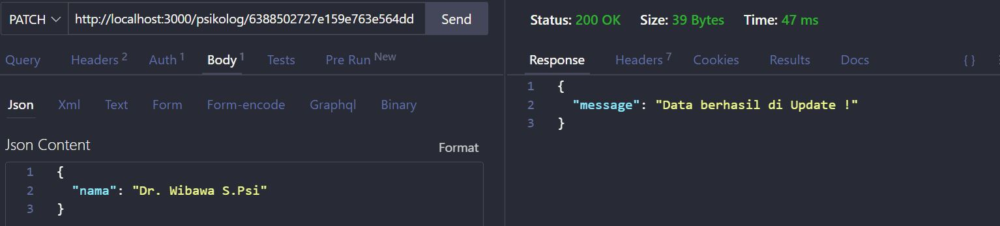

# API Documentation

## _Endpoint Psikolog_

- Router :

  ```js
  const express = require("express");
  const router = express.Router();

  const {
    getAllPsikolog,
    getRecomendedPsikolog,
    addPsikolog,
    updatePsikolog,
    deletePsikolog,
    getDetailPsikolog,
  } = require("../controllers/psikolog.controller");

  router.get("/", getAllPsikolog);
  router.get("/rekomendasi", getRecomendedPsikolog);
  router.get("/:id", getDetailPsikolog);
  router.post("/", addPsikolog);
  router.patch("/:id", updatePsikolog);
  router.delete("/:id", deletePsikolog);

  module.exports = router;
  ```

- Model :

  ```js
  const mongoose = require("mongoose");
  const { Schema } = mongoose;

  const psikologSchema = new Schema({
    nama: {
      type: String,
      required: true,
    },
    gambarURL: {
      type: String,
      required: true,
    },
    spesialis: {
      type: String,
      required: true,
    },
    lokasi: {
      type: String,
      required: true,
    },
    lokasiURL: {
      type: String,
    },
    lulusan: {
      type: String,
    },
    pengalaman: {
      type: String,
      required: true,
    },
    rekomendasi: {
      type: Boolean,
    },
  });

  const Psikolog = mongoose.model("Psikolog", psikologSchema);

  module.exports = Psikolog;
  ```

- Controller :

  - getAllPsikolog :

    ```js
    try {
      const psikolog = await Psikolog.find({});
      res.status(200).json(psikolog);
    } catch (error) {
      res.status(404).json({
        message: "Cannot get psikolog data",
      });
    }
    ```

    

  - getDetailPsikolog :

    ```js
    try {
      const { id } = req.params;
      const psikolog = await Psikolog.findById(id, "-__v -_id");
      res.status(200).json(psikolog);
    } catch (error) {
      res.status(404).json({
        message: "Cannot get psikolog data",
      });
    }
    ```

    

  - getRecomendedPsikolog :

    ```js
    try {
      const psikolog = await Psikolog.find({ rekomendasi: true });

      res.status(200).json(psikolog);
    } catch (error) {
      res.status(404).json({
        message: "Cannot found data",
      });
    }
    ```

    

  - addPsikolog :

    ```js
    try {
      const psikolog = new Psikolog({
        nama: req.body.nama,
        gambarURL: req.body.gambarURL,
        spesialis: req.body.spesialis,
        lokasi: req.body.lokasi,
        lokasiURL: req.body.lokasiURL,
        lulusan: req.body.lulusan,
        pengalaman: req.body.pengalaman,
        rekomendasi: req.body.rekomendasi,
      });
      psikolog.save((err) => {
        if (err) {
          res.status(500).json({
            message: err,
          });
          return;
        } else {
          res.status(200).json({
            message: "Psikolog baru berhasil ditambahkan !",
          });
        }
      });
    } catch (error) {
      res.status(500).json({
        message: error,
      });
    }
    ```

    

  - updatePsikolog :

    ```js
    const { id } = req.params;
    const data = req.body;

    const psikolog = await Psikolog.findByIdAndUpdate(id, data);

    await psikolog.save();

    res.status(200).json({
      message: "Data berhasil di Update !",
    });

    psikolog.save();
    ```

    

  - deletePsikolog :

    ```js
    try {
      const { id } = req.params;
      const psikolog = await Psikolog.findById(id);

      await psikolog.remove();
      res.json({
        message: "Data yang dipilih berhasil dihapus !",
      });
    } catch (error) {
      res.status(500).json({
        message: error,
      });
    }
    ```

    

## _Endpoint User_

- Router :

  ```js
  const express = require("express");
  const router = express.Router();
  const {
    register,
    login,
    getAllUser,
    getDetailUser,
    addUser,
    updateUser,
    deleteUser,
  } = require("../controllers/user.controller");

  router.post("/register", register);
  router.post("/login", login);
  router.get("/", getAllUser);
  router.get("/:id", getDetailUser);
  router.post("/", addUser);
  router.patch("/:id", updateUser);
  router.delete("/:id", deleteUser);

  module.exports = router;
  ```

- Model :

  ```js
  const mongoose = require("mongoose");
  const { Schema } = mongoose;
  const uniqueValidator = require("mongoose-unique-validator");

  const UserSchema = new Schema({
    nama: {
      type: String,
      required: true,
    },
    email: {
      type: String,
      required: true,
      unique: true,
    },
    no_handphone: {
      type: String,
      required: true,
      unique: true,
    },
    role: {
      type: String,
      enum: ["user", "admin"],
      default: "user",
      required: true,
    },
    password: {
      type: String,
      required: true,
    },
  });

  const User = mongoose.model("User", UserSchema);
  UserSchema.plugin(uniqueValidator);

  module.exports = User;
  ```

- Controller :

  - register

    ```js
      register: (req, res) => {
        const user = new User({
          nama: req.body.nama,
          email: req.body.email,
          no_handphone: req.body.no_handphone,
          role: req.body.role,
          password: bcrypt.hashSync(req.body.password, 8),
        });

      user.save((err) => {
        if (err) {
          res.status(500).json({
            message: err,
          });
          return;
        } else {
          res.status(200).json({
            message: "Success register !",
          });
        }
      });
    },
    ```

    

  - login

    ```js
    login: async (req, res) => {
      const user = await User.findOne({
        email: req.body.email,
      }).exec((err, user) => {
      if (err) {
        res.status(500).json({
          message: err,
        });
        return;
      }
      if (!user) {
        return res.status(404).json({
          message: "User not found",
        });
      }
      const passwordIsValid = bcrypt.compareSync(
        req.body.password,
        user.password
      );
      if (!passwordIsValid) {
        return res.json({
          accessToken: null,
          message: "Wrong password",
        });
      }
      const token = jwt.sign(
        {
          id: user.id,
          role: user.role,
        },
        process.env.ACCESS_TOKEN_SECRET,
        {
          expiresIn: "1200s",
        }
      );
      res.status(200).json({
        user: {
          id: user._id,
          email: user.email,
          name: user.name,
          no_handphone: user.no_handphone,
          role: user.role,
        },
        message: "Login success!",
        accessToken: token,
      });
    });
    },
    ```

    

  - getAllUser :

    ```js
    try {
      const user = await User.find({}, "-password -__v -email");
      res.status(200).json(user);
    } catch (error) {
      res.status(500).json({
        message: error,
      });
    }
    ```

    

  - getDetailUser :

    ```js
    try {
      const { id } = req.params;
      const user = await User.findById(id, "-__v -_id");

      res.status(200).json(user);
    } catch (error) {
      res.status(500).json({
        message: error,
      });
    }
    ```

    

  - addUser :

    ```js
    try {
      const data = req.body;
      const user = new User(data);

      user.save();
      if (data !== null) {
        res.status(200).json({
          message: "User baru berhasil ditambahkan !",
        });
      } else {
        return error;
      }
    } catch (error) {
      res.status(500).json({
        message: error,
      });
    }
    ```

    

  - updateUser :

    ```js
    try {
      const { id } = req.params;
      const data = req.body;

      const user = await User.findByIdAndUpdate(id, data);

      if (data !== null) {
        await user.save();

        res.status(200).json({
          message: "Data berhasil di Update !",
        });

        user.save();
      } else {
        return error;
      }
    } catch (error) {
      res.status(500).json({
        message: error,
      });
    }
    ```

    

  - deleteUser :

    ```js
    try {
      const { id } = req.params;
      const user = await User.findById(id);

      await user.remove();
      res.json({
        message: "Data berhasil dihapus !",
      });
    } catch (error) {
      res.status(500).json({
        message: error,
      });
    }
    ```

    

## _Endpoint Article_

- Router

  ```js
  const express = require("express");
  const router = express.Router();

  const {
    addArticle,
    getArticle,
    searchArticle,
    newArticle,
    popularArticle,
    getArticleById,
    deleteArticleById,
    updateArticleById,
  } = require("../controllers/article.controller");

  const { verifyToken } = require("../middleware/VerifyToken");

  router.post("/", addArticle);
  router.get("/", getArticle);
  router.get("/search=:keyword", searchArticle);
  router.get("/new=:keyword", newArticle);
  router.get("/popular=:keyword", popularArticle);
  router.get("/:id", getArticleById);
  router.delete("/:id", deleteArticleById);
  router.patch("/:id", updateArticleById);

  module.exports = router;
  ```

- Model

  ```js
  const mongoose = require("mongoose");
  const { Schema } = mongoose;

  const articleSchema = new Schema({
    title: {
      required: true,
      type: String,
    },
    sub_title: {
      type: String,
    },
    popular: {
      required: true,
      type: Boolean,
      default: false,
    },
    new: {
      required: true,
      type: Boolean,
      default: true,
    },
    genre: {
      required: true,
      type: String,
    },
    imgURL: {
      type: String,
    },
    description: {
      required: true,
      type: String,
    },
    text: {
      required: true,
      type: String,
    },
  });

  const Article = mongoose.model("Article", articleSchema);

  module.exports = Article;
  ```

- Controller

  - addArticle

    ```js
      addArticle: (req, res) => {
        const data = req.body;
        const article = new Article(data);

        article.save();

        res.status(200).json({
          message: "New article has been created !",
        });
      },
    ```

    

  - getArticle

    ```js
      getArticle: async (req, res) => {
        try {
          const article = await Article.find({});
          res.status(200).json(article);
        } catch (error) {
          res.status(500).json({
            message: "Cannot get article data",
          });
        }
      },
    ```

    

  - getArticleById

    ```js
      getArticleById: async (req, res) => {
        try {
          const { id } = req.params;
          const article = await Article.findById(id);

          res.status(200).json(article);
        } catch (error) {
          res.status(404).json({
            message: "Article not found",
          });
        }
      },
    ```

    

  - searchArticle

    ```js
      searchArticle: async (req, res) => {
        try {
          const { keyword } = req.params;
          const article = await Article.find({
            title: { $regex: new RegExp(keyword, "i") },
          });

          res.status(200).json(article);
        } catch (error) {
          res.status(404).json({
            message: "Article not found",
          });
        }
      },
    ```

    

  - newArticle

    ```js
      newArticle: async (req, res) => {
        try {
          const { keyword } = req.params;
          const article = await Article.find({ new: keyword });

          res.status(200).json(article);
        } catch (error) {
          res.status(404).json({
            message: "Article not found",
          });
        }
      },
    ```

    

  - popularArticle

    ```js
       popularArticle: async (req, res) => {
        try {
          const { keyword } = req.params;
          const article = await Article.find({ popular: keyword });
          res.status(200).json(article);
        } catch (error) {
          res.status(404).json({
            message: "Article not found",
          });
        }
      },
    ```

    

  - deleteArticleById

    ```js
     deleteArticleById: async (req, res) => {
      try {
        const { id } = req.params;
        const article = await Article.findById(id);
        await article.remove();

        res.status(200).json({
          message: "Success delete article data",
        });
      } catch (error) {
        res.status(404).json({
          message: "Article not found",
        });
      }
    },
    ```

    

  - updateArticleById

    ```js
    updateArticleById: async (req, res) => {
      try {
        const { id } = req.params;
        const data = req.body;

        const article = await Article.findByIdAndUpdate(id, data);

        await article.save();

        res.status(200).json({
          message: "Article has been updated",
        });

        article.save();
      } catch (error) {
        res.status(404).json({
          message: "Article not found",
        });
      }
    },
    ```

    
