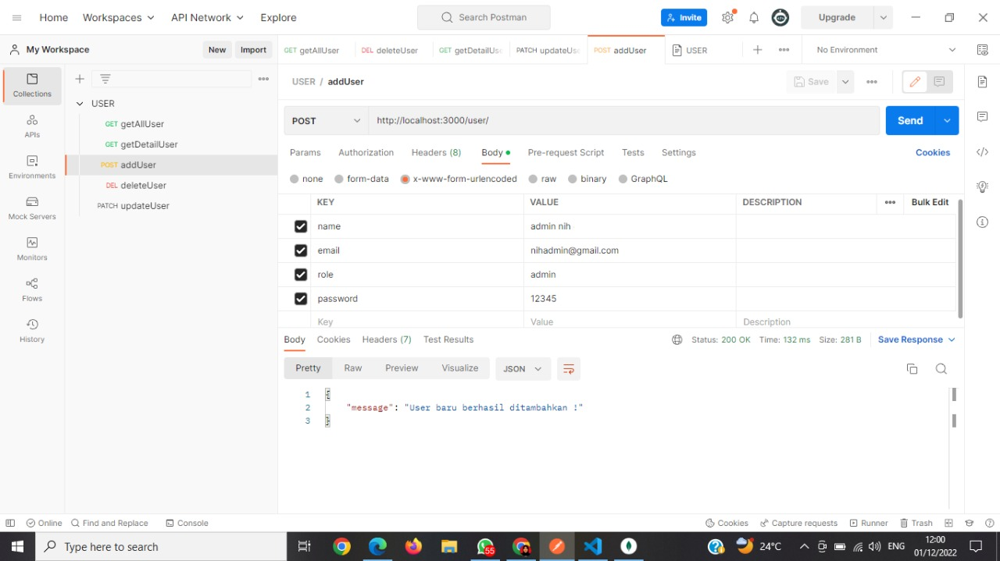

# API Documentation

## _Endpoint Psikolog_

- Router :

  ```js
  const express = require("express");
  const router = express.Router();

  const { getAllPsikolog, getRecomendedPsikolog, addPsikolog, updatePsikolog, deletePsikolog, getDetailPsikolog } = require("../controllers/psikolog.controller");

  router.get("/", getAllPsikolog);
  router.get("/rekomendasi", getRecomendedPsikolog);
  router.get("/:id", getDetailPsikolog);
  router.post("/", addPsikolog);
  router.patch("/:id", updatePsikolog);
  router.delete("/:id", deletePsikolog);

  module.exports = router;
  ```

- Model :

  ```js
  const mongoose = require("mongoose");
  const { Schema } = mongoose;

  const psikologSchema = new Schema({
    nama: {
      type: String,
      required: true,
    },
    gambarURL: {
      type: String,
      required: true,
    },
    spesialis: {
      type: String,
      required: true,
    },
    lokasi: {
      type: String,
      required: true,
    },
    lokasiURL: {
      type: String,
    },
    lulusan: {
      type: String,
    },
    pengalaman: {
      type: String,
      required: true,
    },
    rekomendasi: {
      type: Boolean,
    },
  });

  const Psikolog = mongoose.model("Psikolog", psikologSchema);

  module.exports = Psikolog;
  ```

- Controller :

  - getAllPsikolog :

    ```js
    try {
      const psikolog = await Psikolog.find({});
      res.status(200).json(psikolog);
    } catch (error) {
      res.status(404).json({
        message: "Cannot get psikolog data",
      });
    }
    ```

    

  - getDetailPsikolog :

    ```js
    try {
      const { id } = req.params;
      const psikolog = await Psikolog.findById(id, "-__v -_id");
      res.status(200).json(psikolog);
    } catch (error) {
      res.status(404).json({
        message: "Cannot get psikolog data",
      });
    }
    ```

    

  - getRecomendedPsikolog :

    ```js
    try {
      const psikolog = await Psikolog.find({ rekomendasi: true });

      res.status(200).json(psikolog);
    } catch (error) {
      res.status(404).json({
        message: "Cannot found data",
      });
    }
    ```

    

  - addPsikolog :

    ```js
    try {
      const psikolog = new Psikolog({
        nama: req.body.nama,
        gambarURL: req.body.gambarURL,
        spesialis: req.body.spesialis,
        lokasi: req.body.lokasi,
        lokasiURL: req.body.lokasiURL,
        lulusan: req.body.lulusan,
        pengalaman: req.body.pengalaman,
        rekomendasi: req.body.rekomendasi,
      });
      psikolog.save((err) => {
        if (err) {
          res.status(500).json({
            message: err,
          });
          return;
        } else {
          res.status(200).json({
            message: "Psikolog baru berhasil ditambahkan !",
          });
        }
      });
    } catch (error) {
      res.status(500).json({
        message: error,
      });
    }
    ```

    

  - updatePsikolog :

    ```js
    const { id } = req.params;
    const data = req.body;

    const psikolog = await Psikolog.findByIdAndUpdate(id, data);

    await psikolog.save();

    res.status(200).json({
      message: "Data berhasil di Update !",
    });

    psikolog.save();
    ```

    

  - deletePsikolog :

    ```js
    try {
      const { id } = req.params;
      const psikolog = await Psikolog.findById(id);

      await psikolog.remove();
      res.json({
        message: "Data yang dipilih berhasil dihapus !",
      });
    } catch (error) {
      res.status(500).json({
        message: error,
      });
    }
    ```

    

## _Endpoint User_

- Router :

  ```js
  const express = require("express");
  const router = express.Router();
  const { register, login, getAllUser, getDetailUser, addUser, updateUser, deleteUser } = require("../controllers/user.controller");

  router.post("/register", register);
  router.post("/login", login);
  router.get("/", getAllUser);
  router.get("/:id", getDetailUser);
  router.post("/", addUser);
  router.patch("/:id", updateUser);
  router.delete("/:id", deleteUser);

  module.exports = router;
  ```

- Model :

  ```js
  const mongoose = require("mongoose");
  const { Schema } = mongoose;
  const uniqueValidator = require("mongoose-unique-validator");

  const UserSchema = new Schema({
    nama: {
      type: String,
      required: true,
    },
    email: {
      type: String,
      required: true,
      unique: true,
    },
    no_handphone: {
      type: String,
      required: true,
      unique: true,
    },
    role: {
      type: String,
      enum: ["user", "admin"],
      default: "user",
      required: true,
    },
    password: {
      type: String,
      required: true,
    },
  });

  const User = mongoose.model("User", UserSchema);
  UserSchema.plugin(uniqueValidator);

  module.exports = User;
  ```

- Controller :

  - getAllUser :

    ```js
    try {
      const user = await User.find({}, "-password -__v -email");
      res.status(200).json(user);
    } catch (error) {
      res.status(500).json({
        message: error,
      });
    }
    ```

    

  - getDetailUser :

    ```js
    try {
      const { id } = req.params;
      const user = await User.findById(id, "-__v -_id");

      res.status(200).json(user);
    } catch (error) {
      res.status(500).json({
        message: error,
      });
    }
    ```

    

  - addUser :

    ```js
    try {
      const data = req.body;
      const user = new User(data);

      user.save();
      if (data !== null) {
        res.status(200).json({
          message: "User baru berhasil ditambahkan !",
        });
      } else {
        return error;
      }
    } catch (error) {
      res.status(500).json({
        message: error,
      });
    }
    ```

    

  - updateUser :

    ```js
    try {
      const { id } = req.params;
      const data = req.body;

      const user = await User.findByIdAndUpdate(id, data);

      if (data !== null) {
        await user.save();

        res.status(200).json({
          message: "Data berhasil di Update !",
        });

        user.save();
      } else {
        return error;
      }
    } catch (error) {
      res.status(500).json({
        message: error,
      });
    }
    ```

    

  - deleteUser :

    ```js
    try {
      const { id } = req.params;
      const user = await User.findById(id);

      await user.remove();
      res.json({
        message: "Data berhasil dihapus !",
      });
    } catch (error) {
      res.status(500).json({
        message: error,
      });
    }
    ```

    
